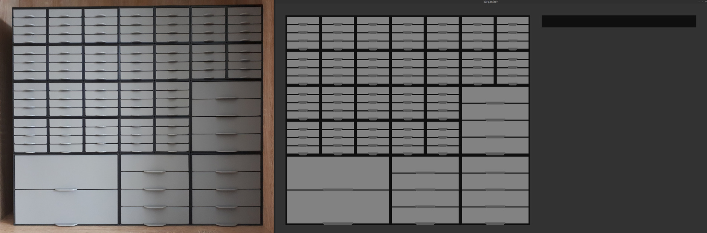
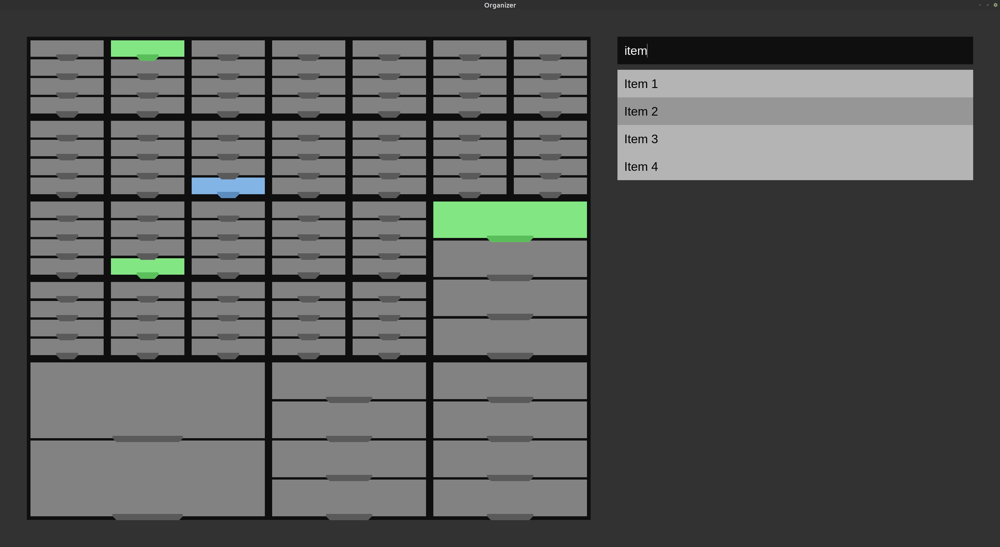
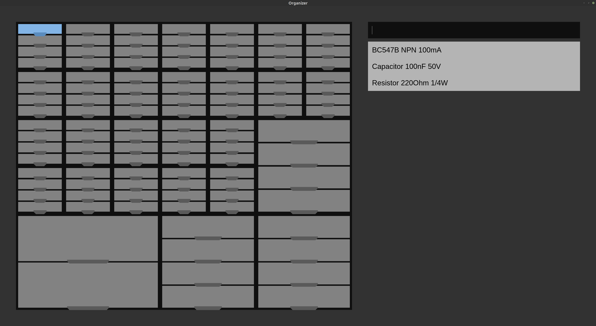

# Organizer



## Overview
I recently printed myself the [Various Size Stackable Resistor Storage Box](https://www.prusaprinters.org/prints/7643 "https://www.prusaprinters.org/prints/7643") by termlimit to store all my electronics utilities and other small items. With around 270h of print time and around 5.3kg of filament this was neither a short nor cheap endeavour, but it fits my needs better than every storage system I could find for sale.
To keep track of all my items without labels I wrote this graphical interface in python3 using pyglet. See [How to use](#how-to-use) for a detailed description of the functionality.


## Installation
The graphical interface is powered by pyglet, it can be installed with
```shell
pip3 install pyglet
```
After pyglet is installed, clone the repository and cd into it
```shell
git clone https://github.com/julianschuler/organizer.git
cd organizer/
```
It can be now continued with the initial setup.


## Setting up the organizer
Before starting the programm, the layout of the organizer has to be configured first by
editing [`organizer.conf`](organizer.conf).
In the first lines labels (single letters) are defined and assigned a number. All boxes with the same label will later have its number as amount of drawers.

Example: All boxes labeled with "a" or "b" will have 4 drawers, all boxes labeled with "c" will have 2 drawers:
```text
a:4
b:4
c:4
```

The actual layout is defined in the following lines with each label representing one block. Each box consists at least of one block, adjacent blocks with the same label will be treated as one box.

Example: An organizer consisting of one 2x2 box with 2 drawers and two 1x1 boxes with 4 drawers each (using the label definitions from the previous example):
```text
c c a
c c b
```

After the layout is adapted to the actual organizer, the program can now be started with
```shell
python3 organizer.py
```
and should match the configured layout. See [Changing the layout](#changing-the-layout) on how to change it.


## Changing the layout
To change the layout, exit the program if running, make your changes in [`organizer.conf`](organizer.conf), delete or move `organizer.db` and start the program again. Attention: Since all the items are saved in `organizer.db`, they are lost after this step and have to be added again!


## How to use
After everything is set up, the program can be run from the repository directory with
```shell
python3 organizer.py
```
A drawer can be selected by clicking on them or navigating to it using the arrow keys and hitting enter. By clicking somewhere else within the window or hitting enter again, the drawer is unselected. Hit the escape key to remove all highlighting.
If no drawer is selected, the text field serves as a search bar, listing all items containing the search terms and highlighting their corresponding drawers. By using the arrow keys, one item of the list can be selected, its drawer is being highlighted in a different color. You can hit enter to select the drawer to e.g. add items to it.

Example: All drawers containing the term "item" are highlighted, the drawer with "Item 2" is selected and highlighted seperately:


When a drawer is selected, items can be added, removed or renamed. An item can be added by typing its name to the text field and hitting enter. By selecting an item with the arrow keys and hitting the delete key, it will be removed. Attention: This process can't be undone! An item can be renamed by selecting it and hitting enter, hitting enter again saves all changes, escape discards them. To unselect the current drawer, hit the escape key or navigate up until no item is selected and hit enter.

Example: The top left drawer is selected, it containes three items. Items can now be added to it, removed or renamed:



## License
This project is licensed under the MIT license, see [`LICENSE.txt`](LICENSE.txt) for further information.
